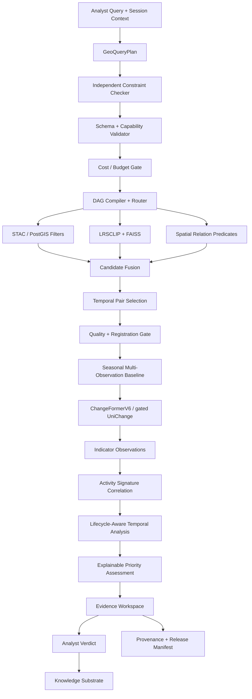

# Tessera-X

> **Offline Semantic Earth-Observation Intelligence**
>
> Search satellite archives by meaning, ground spatial relations deterministically, verify what changed over time, identify the earliest supported observation, and preserve a reproducible evidence trail — entirely offline.

---

## Implementation status

The geospatial foundation now includes scene inspection, COG preparation, source-linked patch extraction, local STAC bundles, and a transactional PostGIS adapter. See [the ingestion operator guide](docs/INGESTION.md) for commands, tests, and remaining gate prerequisites. The semantic retrieval and temporal intelligence described below remain planned capabilities.

## 1. What Tessera-X Is

Tessera-X is an offline Earth-observation intelligence system for analysts who need to search and investigate large satellite-image archives without depending on cloud APIs.

Traditional archive search starts with metadata:

- coordinates
- acquisition dates
- sensor names
- scene identifiers
- cloud-cover thresholds

Tessera-X adds a semantic and temporal intelligence layer so an analyst can instead ask:

```text
show me new construction near a river since 2022
```

The system does **not** send that sentence directly to a model and trust the answer.

It compiles analyst intent into a validated `GeoQueryPlan`, executes deterministic geospatial filters and semantic retrieval, applies change detection only to the reduced candidate set, and returns source-linked evidence.

The core product principle is:

> **The language model plans. Geospatial operators ground. Retrieval models rank. Change models measure. The analyst decides what becomes evidence.**

---

## 2. Core Capabilities

Tessera-X is designed around eight operational capabilities.

### 2.1 Natural-language satellite retrieval

Search the archive using descriptive text:

```text
new residential plots on cleared land
```

```text
building expansion beside a water body
```

```text
new roads crossing agricultural fields
```

The text is transformed into one or more remote-sensing-compatible prompts and encoded using a frozen remote-sensing vision-language model.

### 2.2 Deterministic spatial-relation grounding

Expressions such as:

```text
near a river
inside an industrial zone
adjacent to a road
within the current AOI
```

are **not left to CLIP-style similarity**.

They are compiled into PostGIS predicates over versioned feature layers.

Example:

```sql
ST_DWithin(
    patch_geom::geography,
    river_geom::geography,
    :distance_m
)
```

The evidence record preserves:

- predicate
- feature identity
- geometry-layer version
- applied distance
- whether the distance was user-specified or defaulted

### 2.3 Temporal change verification

After semantic and geospatial filtering, Tessera-X fetches suitable temporal observations and performs change analysis.

The comparison baseline is not assumed to be the immediately preceding image. For monitored areas, Tessera-X can construct a versioned historical baseline from multiple quality-valid, seasonally comparable observations with compatible sensor and resolution characteristics. Every baseline retains its member scenes and construction policy so an analyst can inspect the source evidence.

The executable baseline uses:

```text
ChangeFormerV6
```

for binary change localization.

The full semantic-change path may use:

```text
UniChange
```

only after an explicit deployment gate is passed.

### 2.4 Earliest supported observation

Tessera-X does not claim to know the exact real-world time at which construction, clearing, flooding, or another event occurred.

Instead it reports:

> **the earliest usable satellite observation that supports the change**

The timeline logic explicitly skips or downweights observations affected by:

- cloud
- cloud shadow
- poor registration
- insufficient overlap
- invalid pixels
- unacceptable quality

For confirmed activity, the same timeline also records the observable lifecycle:

```text
first_seen → expanding → persistent → contracting → no_longer_supported
```

Lifecycle states describe support in available imagery; they do not assert the exact real-world start or end time of an activity.

### 2.5 Similar-site discovery

A confirmed site can seed a new search:

```text
find places similar to SITE_0042
```

FAISS remains the authoritative similarity engine.

The knowledge layer may materialize a **sparse top-N operational projection** of similarity edges for confirmed sites and actively reviewed entities. It does not attempt an all-pairs graph.

Confirmed multi-temporal activity signatures can also seed discovery. Signature retrieval combines before/after visual change, indicator composition, temporal progression, and spatial context. FAISS produces candidates; deterministic and model-based indicator checks verify whether each candidate actually matches the requested signature.

### 2.6 Multi-indicator activity signatures

Tessera-X can correlate individually observable indicators such as:

- temporary or newly appearing structures
- new tracks or access routes
- ground disturbance
- vegetation or land clearing
- infrastructure expansion

Each indicator is stored as a source-linked `IndicatorObservation`. A versioned `ActivitySignature` defines which indicators are required or optional, their permitted spatial separation, their temporal co-occurrence window, and their persistence policy.

The system reports an observed pattern, not an inferred actor or intent.

### 2.7 Explainable prioritization

Eligible locations can be prioritized using an inspectable evidence vector containing:

- proximity evidence
- change intensity and affected area
- duration and persistence
- number and diversity of concurrent indicators
- observation, registration, and model quality

Hard constraints remain filters. Priority is kept separate from evidence confidence, and every score preserves its component values, weights, policy version, and missing-data penalties.

### 2.8 Evidence and provenance

Every candidate can be traced to:

- source scenes
- acquisition timestamps
- geographic footprint
- model versions
- prompt set
- query plan
- spatial predicates
- quality measurements
- registration metrics
- release manifest
- analyst verdict

---

## 3. Why Tessera-X Is Different

The differentiator is not a single AI model.

It is the integration of:

```text
analyst language
    ↓
validated query plan
    ↓
deterministic geospatial grounding
    ↓
semantic retrieval
    ↓
quality-gated temporal analysis
    ↓
human verification
    ↓
reproducible evidence
```

This prevents a common failure mode in AI search systems:

```text
plausible result
≠
auditable result
```

Tessera-X is built so that a result can explain:

- what the analyst asked
- what the planner understood
- which assumptions were applied
- which constraints were ignored or unresolved
- which operators ran
- how the candidate count changed
- which source observations support the result
- which release can reproduce it

---

## 4. System Overview



---

## 5. Design Principles

### 5.1 Frozen semantic encoder

New imagery is appended to a stable embedding namespace.

Normal ingestion does not fine-tune the semantic encoder.

This avoids:

```text
old vectors → encoder v1
new vectors → encoder v2
```

inside the same search space.

A model upgrade creates a **new namespace**.

### 5.2 Evidence before automation

AI produces candidates.

The analyst confirms, rejects, or defers.

No generated visualization replaces source observations.

### 5.3 Cheap operators before expensive operators

The system should reduce the search space in this order whenever possible:

```text
metadata
    ↓
geospatial predicates
    ↓
vector search
    ↓
quality checks
    ↓
registration
    ↓
change inference
```

Change inference is a terminal analysis stage, not an archive-wide scan.

### 5.4 Deterministic control where possible

Tessera-X prefers deterministic mechanisms for:

- schema validation
- dates
- numeric constraints
- AOI resolution
- sensor filters
- spatial relations
- feature coverage
- capability checks
- release/version tracking

The local LLM is an optional planner tier, not the source of truth.

### 5.5 No self-reported planner confidence

An LLM-generated number such as:

```json
"confidence": 0.86
```

is not treated as calibrated confidence.

Tessera-X computes planner confidence from measurable plan coverage.

Example:

```text
PlanConfidence =
    slot_coverage
  × constraint_coverage
  × lexicon_coverage
  × capability_coverage
  × default_penalty
```

The exact formula is calibrated on the planner evaluation set.

### 5.6 Version everything that can change meaning

A reproducible result references:

- code revision
- model weights
- embedding namespace
- FAISS shard set
- STAC snapshot
- feature-layer version
- prompt version
- lexicon version
- quality-policy version
- relation-policy version
- evaluation-pack version
- baseline-policy version
- activity-signature definition version
- lifecycle-policy version
- priority-policy version

### 5.7 Separate observation, confidence, and priority

Tessera-X keeps three concepts distinct:

```text
observation = what source imagery supports
confidence  = how reliable that evidence is
priority    = how strongly the evidence matches a review policy
```

A priority score cannot convert weak evidence into a fact, and no activity signature is treated as proof of intent.

---

## 6. Query Understanding

The contract between language and execution is the `GeoQueryPlan`.

Example:

```json
{
  "plan_id": "PLAN_2026_09_05_0007",
  "raw_query": "show me new construction near the river since 2022",
  "intent": "change_search",

  "targets": [
    {
      "concept": "building",
      "lexicon_id": "LEX_BUILDING_DENSE",
      "role": "appears"
    }
  ],

  "text_prompts": [
    "an aerial view of newly constructed buildings on cleared ground",
    "a satellite image showing recent building construction",
    "new rooftops beside exposed soil"
  ],

  "spatial": {
    "aoi": {
      "type": "named",
      "value": "AOI_PUDUPPAIR"
    },
    "relations": [
      {
        "predicate": "within_distance",
        "feature_class": "waterway_river",
        "distance_m": 300,
        "policy_id": "REL_NEAR_RIVER_V1",
        "default_applied": true
      }
    ]
  },

  "temporal": {
    "start": "2022-01-01",
    "end": "2026-08-31",
    "pair_policy": "earliest_supported"
  },

  "filters": {
    "sensors": ["S2"],
    "max_cloud": 0.20,
    "min_quality": 0.70
  },

  "budget": {
    "max_candidates": 2000,
    "max_change_pairs": 40
  },

  "unresolved_slots": [],
  "ignored_terms": [],
  "release_id": "REL_2026_09_05"
}
```

---

## 7. Independent Constraint Checking

The planner is not allowed to validate itself.

A separate deterministic checker extracts high-value constraints from the raw query and compares them with the generated plan.

It checks:

```text
dates
date ranges
numbers
distance expressions
AOI names
sensor names
spatial relation terms
recognized target concepts
negations
```

Example:

```text
Raw query:
"show new construction within 500 m of a river since 2022"

Independent extraction:
target = construction
relation = within_distance
distance = 500 m
feature = river
start = 2022

Generated plan:
distance = 300 m
```

Result:

```text
PLAN REJECTED
reason = explicit numeric constraint changed
```

This is stronger than asking the same LLM to both produce and audit the plan.

---

## 8. Spatial Relation Policy

Default spatial distances are contextual, not universal.

A versioned policy table defines defaults.

Example:

| Relation | Feature class | Default |
|---|---|---:|
| near | river | 300 m |
| near | major road | 150 m |
| adjacent | parcel | 30 m |
| along | roadway | 100 m |
| away from | industrial site | 1000 m |

Schema:

```sql
relation_policy(
    policy_id,
    relation,
    feature_class,
    default_distance_m,
    min_distance_m,
    max_distance_m,
    version,
    active
);
```

An explicit analyst distance always overrides the default.

---

## 9. Spatial Evidence Semantics

The MVP does **not** claim:

> the detected building is exactly 140 m from the river

unless an object footprint has been measured.

Instead the system can safely claim:

> a building-relevant image patch intersects the 300 m river-proximity zone

or:

> the candidate patch geometry is within the configured distance of the named river feature

This distinction prevents the system from turning patch-level evidence into unsupported object-level geometry.

---

## 10. Semantic Retrieval

Primary semantic model:

```text
LRSCLIP
```

Policy:

```text
frozen encoder
```

Index:

```text
FAISS HNSW
```

Optional memory reduction:

```text
SQ8
```

The planner may generate multiple remote-sensing-caption-style prompts.

Query vector:

```text
v_query =
normalize(
    mean(
        normalize(E_text(prompt_i))
    )
)
```

Prompt ensembles are enabled only if the local retrieval benchmark shows improvement.

Negative prompt steering is treated as an experimental feature and must be benchmarked before promotion.

---

## 11. Change Detection Policy

### Baseline executable path

```text
ChangeFormerV6
```

Purpose:

```text
binary change localization
```

### Semantic upgrade path

```text
UniChange
```

UniChange is treated correctly as a multimodal large-language-model-based unified change-detection framework with:

- T1 image
- T2 image
- textual instruction
- task-specific `[T1]`, `[T2]`, `[CHANGE]` tokens
- remote-sensing visual features
- Token Driven Decoder
- binary and semantic change outputs

It is **not described as a conventional Siamese Transformer**.

UniChange is promoted only when the deployment gate passes.

---

## 12. UniChange Deployment Gate

Required conditions:

- inference code reproduces locally
- compatible checkpoint is available
- licensing is acceptable for the deployment
- checkpoint fits the target hardware
- a public benchmark sample can be reproduced
- geospatial mapping of outputs is correct
- inference latency is acceptable
- semantic outputs outperform or materially extend the baseline

Failure of this gate does not fail Tessera-X.

The binary-change baseline remains available.

---

## 13. Quality-Aware Confidence

A neural-network probability is not the final operational confidence.

Initial policy:

```text
EffectiveConfidence =
    ModelConfidence
  × RegistrationQuality
  × ObservationQuality
```

The implementation may later move to a calibrated function learned from the locked local evaluation set.

A result may be rejected before change inference when:

- registration fails
- usable overlap is insufficient
- cloud fraction is excessive
- nodata is excessive
- required source bands are unavailable

---

## 14. Temporal Localization

Tessera-X returns:

```yaml
last_supported_no_change:
earliest_supported_change:
next_confirming_observation:
current_lifecycle_state:
lifecycle_history:
area_trajectory:
unusable_observations:
confidence:
```

The algorithm operates over **usable observations**, not blindly over calendar order.

This avoids incorrect binary-search assumptions in timelines containing:

```text
clear
cloud
clear
bad registration
clear
cloud
```

The baseline used for each comparison is a `BaselineSet`, not an anonymous composite. It records the season window, compatible sensor policy, quality thresholds, construction method, and every contributing scene. When activity geometry can be measured, the timeline also tracks area and rate of change across observations.

---

## 15. Knowledge Substrate

Tessera-X uses PostgreSQL/PostGIS as the machine truth.

Core graph representation:

```text
Site
Scene
Patch
ChangeEvent
BaselineSet
IndicatorObservation
ActivitySignature
ActivityAssessment
Query
Candidate
Verdict
Concept
Feature
Model
Release
Report
```

Change events are represented explicitly as nodes.

Example:

```text
ChangeEvent CHG_00942
    ├── at_site ───────► SITE_0042
    ├── baseline ──────► SCENE_T1
    ├── comparison ────► SCENE_T2
    ├── classified_as ─► construction
    └── derived_from ──► REL_2026_09_05
```

This avoids trying to represent a ternary temporal relationship with one binary edge.

An activity assessment links a site to the exact indicator observations, signature definition, lifecycle state, baseline, and priority policy used to produce it.

---

## 16. Sparse Similarity Graph

FAISS performs similarity retrieval.

The graph stores only a sparse operational projection.

Recommended rule:

```text
materialize top-N similarity edges
only for:
    confirmed sites
    actively reviewed candidates
    curated reference examples
```

Every materialized edge records:

```yaml
encoder_version:
embedding_namespace:
distance:
rank:
release_id:
```

A model promotion invalidates embedding-derived edges from the old namespace for new operational use.

For signature-level search, a versioned signature vector may combine:

```text
before/after visual delta embedding
+ indicator-presence vector
+ normalized temporal trajectory
+ spatial-context features
```

The vector is used only for candidate generation. A signature verifier rechecks required indicators, spatial relationships, timing, quality, and lifecycle compatibility before presenting a match.

---

## 17. Provenance

A result should be reproducible from a release manifest.

Example:

```json
{
  "result_id": "CHG_00942",
  "plan_id": "PLAN_2026_09_05_0007",
  "release_id": "REL_2026_09_05",

  "scenes": {
    "t1": "S2_2023_01_05_T44PLT",
    "t2": "S2_2023_03_16_T44PLT"
  },

  "bbox": [80.14, 12.68, 80.15, 12.69],

  "semantic_encoder": {
    "name": "LRSCLIP",
    "namespace": "ns_lrsclip_v1_768"
  },

  "change_model": {
    "name": "ChangeFormerV6",
    "version": "v1"
  },

  "baseline": {
    "baseline_id": "BASE_SITE_0042_V1",
    "member_scene_ids": ["S2_2022_01_10_T44PLT", "S2_2022_02_19_T44PLT"],
    "policy_version": "baseline_v1"
  },

  "activity": {
    "assessment_id": "ACT_0042_001",
    "signature_definition_id": "SIG_CLEARING_TRACK_STRUCTURE_V1",
    "matched_indicator_ids": ["IND_101", "IND_102", "IND_103"],
    "lifecycle_state": "expanding"
  },

  "priority": {
    "score": 0.81,
    "band": "high",
    "evidence_confidence": 0.73,
    "policy_version": "priority_v1"
  },

  "spatial_predicates": [
    {
      "predicate": "within_distance",
      "feature_id": "osm:way/12345",
      "distance_m": 140,
      "policy_id": "REL_NEAR_RIVER_V1",
      "layer_version": "osm_2026_06"
    }
  ],

  "quality": {
    "registration_rmse_px": 0.41,
    "t1_quality": 0.94,
    "t2_quality": 0.89
  },

  "analyst_status": "confirmed"
}
```

---

## 18. Ground-Truth Strategy

Tessera-X has separate evaluation evidence for separate claims.

### Retrieval benchmark

Create a local query-relevance pack containing:

- natural-language queries
- pooled candidate results
- blinded relevance judgments
- graded labels

Recommended metrics:

- nDCG@5
- nDCG@10
- Precision@5
- Precision@10
- MRR

### Binary change benchmark

Use public labeled change datasets plus a local hard-negative-heavy validation pack.

Metrics:

- Precision
- Recall
- F1
- IoU
- false-alarm breakdown

### Semantic change benchmark

When UniChange is enabled, use an appropriate semantic-change benchmark and local semantic annotations.

### Temporal localization benchmark

Each selected AOI records:

- last supported no-change observation
- earliest supported change observation
- unusable scenes
- next confirming observation

Metrics:

- exact acquisition match
- error in number of valid acquisitions
- temporal error
- unusable-observation handling

### Activity-intelligence benchmark

Use curated multi-observation site timelines with independent labels for indicators, signature matches, lifecycle states, affected-area trajectories, reviewer priority under a fixed policy, and similar-signature relevance.

Measure:

- per-indicator precision and recall
- signature-level precision and recall
- lifecycle-state agreement and area error
- priority-ranking quality, independently from confidence calibration
- verified-signature nDCG@K against image-only retrieval

---

## 19. Repository Layout

Recommended repository structure:

```text
Tessera-X/
├── README.md
├── docs/
│   ├── PLAN.md
│   ├── ARCHITECTURE.md
│   └── ADR-001-ACTIVITY-INTELLIGENCE.md
├── LICENSE
├── pyproject.toml
├── .env.example
│
├── configs/
│   ├── app.yaml
│   ├── models.yaml
│   ├── quality.yaml
│   ├── relation_policy.yaml
│   ├── baseline_policy.yaml
│   ├── activity_signatures.yaml
│   ├── priority_policy.yaml
│   └── budgets.yaml
│
├── src/
│   └── tessera_x/
│       ├── api/
│       ├── planner/
│       ├── validation/
│       ├── orchestration/
│       ├── geospatial/
│       ├── ingestion/
│       ├── embeddings/
│       ├── retrieval/
│       ├── change/
│       ├── baseline/
│       ├── indicators/
│       ├── activity/
│       ├── priority/
│       ├── temporal/
│       ├── evidence/
│       ├── knowledge/
│       ├── provenance/
│       └── evaluation/
│
├── migrations/
├── prompts/
├── grammars/
├── lexicon/
├── eval/
│   ├── retrieval/
│   ├── change/
│   ├── temporal/
│   ├── activity/
│   ├── signature_similarity/
│   └── planner/
│
├── manifests/
├── scripts/
├── tests/
│   ├── unit/
│   ├── integration/
│   ├── regression/
│   └── offline/
│
├── labels/
└── docker/
```

Large raster data, model weights, and vector-index shards should not live in Git history.

---

## 20. Suggested Runtime Stack

### Geospatial

- GDAL
- Rasterio
- GeoPandas
- Shapely
- PyProj
- AROSICS
- PostgreSQL + PostGIS
- PySTAC / STAC-compatible metadata

### AI

- PyTorch
- LRSCLIP
- ChangeFormerV6
- optional gated UniChange

### Retrieval

- FAISS
- HNSW
- optional SQ8

### Backend

- FastAPI
- Pydantic
- Python

### Frontend

- React / Next.js
- MapLibre GL or OpenLayers

### Packaging

- Docker
- Docker Compose

Distributed orchestration is intentionally not a baseline requirement.

---

## 21. Primary API Surface

```text
POST /plan
POST /plan/{plan_id}/execute
GET  /plan/{plan_id}/explain

POST /search
POST /similar
POST /similar/signature

POST /change/analyze
POST /change/earliest-supported

POST /activity/analyze
GET  /activity/{assessment_id}/timeline
GET  /activity/{assessment_id}/explain

POST /verdict
GET  /evidence/{result_id}

GET  /release/{release_id}
POST /release
```

---

## 22. `/plan/{id}/explain`

This endpoint is a first-class product feature.

Example output:

```text
Raw archive patches               1,040,000
STAC/AOI/date filter                  23,412
Semantic top-K                         2,000
River proximity predicate                186
Quality-valid temporal candidates          61
Registered candidate pairs                 38
Change-supported candidates                 7
```

It should also show:

```text
explicit constraints
defaults applied
ignored terms
capability degradations
relation policies
cache hits
release ID
operator versions
```

This is how Tessera-X demonstrates that it does not silently guess.

---

## 23. Offline Requirement

A release is valid only if the full demo can run with outbound network access disabled.

Local dependencies include:

- imagery
- feature layers
- model weights
- STAC snapshot
- FAISS index
- database
- lexicon
- prompts
- release manifest

No operational step may require:

- hosted LLM APIs
- cloud vector databases
- external tile servers
- online geocoding
- remote inference endpoints

---

## 24. Versioning Strategy

Tessera-X separates state into:

### Code

Git.

### Decisions

Git-friendly files:

- labels
- verdict exports
- evaluation definitions
- prompt templates
- policies

### Large artifacts

Content-addressed storage or DVC with a local remote:

- COGs
- patch packs
- model weights
- index shards
- masks

### Database

- migrations
- versioned snapshots
- release references

---

## 25. Embedding Namespace Migration

A new semantic encoder does not overwrite the old index.

Process:

```text
new model
   ↓
new embedding namespace
   ↓
priority re-embedding
   ↓
dual-index evaluation
   ↓
locked benchmark gate
   ↓
promotion
```

Promotion criteria prioritize:

1. no regression on the locked labeled retrieval benchmark
2. improvement or justified trade-off on target operational concepts
3. acceptable runtime and storage
4. analyst review of material disagreements

Old-vs-new top-K overlap is a **diagnostic**, not the definition of success.

The old namespace is retained for reproducibility of historical reports.

---

## 26. Planner Strategy

Planner tiers:

```text
1. cache
2. deterministic rules
3. local constrained LLM
```

The rule tier supports the most important query shapes:

```text
<concept> near <feature>
<concept> in <AOI>
<concept> since <date>
changes in <AOI> between <d1> and <d2>
sites similar to <site_id>
```

The LLM tier is an enhancement for free-form language, not a dependency for core demo paths.

---

## 27. Planner Safety Rules

The planner must not:

- invent explicit analyst constraints
- alter numeric constraints
- silently drop a recognized constraint
- create unsupported feature classes
- run an unavailable operator
- exceed the configured execution budget without degradation or confirmation

All defaulted values are marked.

All unresolved high-value constraints are surfaced.

---

## 28. Product Demo

A complete demonstration should look like this:

```text
Analyst:
"show me new construction near the river since 2022"

        ↓

Tessera-X:
Plan interpreted
- target: construction
- AOI: current workspace
- time: 2022 → selected end date
- relation: near river
- default relation distance: 300 m
- sensor: Sentinel-2

        ↓

Candidate reduction trace
1,040,000 → 23,412 → 2,000 → 186 → 38

        ↓

Map results

        ↓

Select candidate

        ↓

T1 / T2 source imagery
registration quality
binary change mask
quality-aware confidence

        ↓

timeline
earliest supported change
observable lifecycle and area trajectory
matched activity indicators
priority components and confidence

        ↓

analyst confirms / rejects

        ↓

provenance package
```

If the UniChange gate has passed, the same workflow may additionally report a semantic transition such as:

```text
low vegetation → built-up
```

---

## 29. Non-Goals of the Core System

The core architecture does not require:

- end-to-end autonomous regulatory decisions
- generated cloud-free imagery as source evidence
- continual fine-tuning of the semantic encoder during ingestion
- archive-wide change inference
- a dedicated graph database
- distributed Kubernetes infrastructure
- all-pairs similarity graphs
- full semantic-change-model training
- hidden LLM reasoning as evidence
- intent attribution from observed activity patterns

---

## 30. Key Failure Modes

Tessera-X explicitly tests and records:

- seasonal false change
- cloud and cloud-shadow contamination
- registration artifacts
- sensor domain shift
- planner constraint invention
- planner constraint omission
- stale caches across releases
- stale similarity edges after encoder promotion
- seasonal or sensor-mismatched historical baselines
- correlated errors across multiple indicator detectors
- priority scores presented as evidence confidence
- single-image lookalikes returned as signature matches
- retrieval bias
- analyst-feedback bias loops
- incomplete feature-layer coverage
- query scope beyond archive coverage

---

## 31. Success Criteria

A release is technically credible when it can demonstrate:

```text
semantic retrieval
+
deterministic spatial grounding
+
quality-gated temporal verification
+
versioned historical baselines
+
source-linked multi-indicator correlation
+
observable lifecycle measurement
+
explained priority separate from confidence
+
verified multi-temporal signature discovery
+
source-linked provenance
+
locked evaluation
+
offline reproducibility
```

The goal is not to maximize the number of AI components.

The goal is to make every component necessary, measurable, and explainable.

---

## 32. Documentation

See:

- [`docs/PLAN.md`](./docs/PLAN.md) — phased implementation and validation roadmap
- [`docs/ARCHITECTURE.md`](./docs/ARCHITECTURE.md) — complete system architecture and technical contracts
- [`docs/ADR-001-ACTIVITY-INTELLIGENCE.md`](./docs/ADR-001-ACTIVITY-INTELLIGENCE.md) — rationale and trade-offs for the activity-intelligence extension

---

## 33. One-Line Pitch

> **Tessera-X turns natural-language geospatial questions into constrained, auditable satellite computations and evidence-backed change intelligence — offline.**
