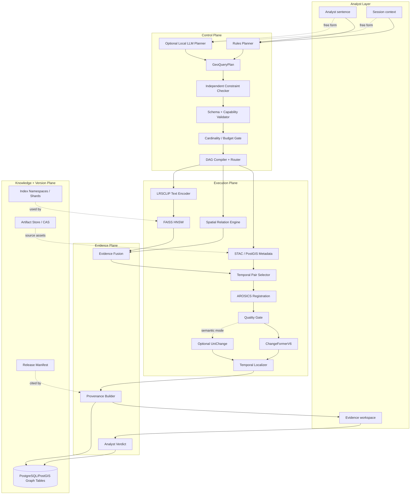
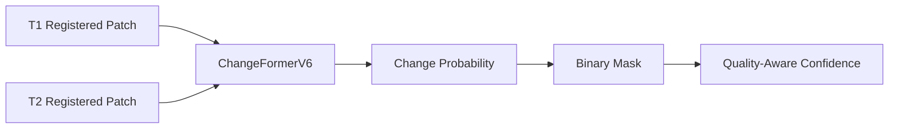
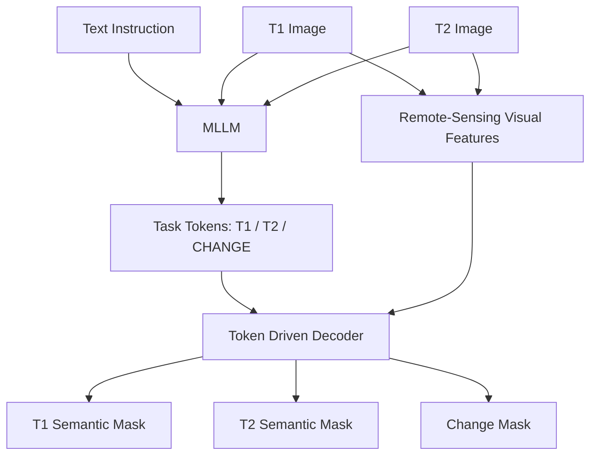
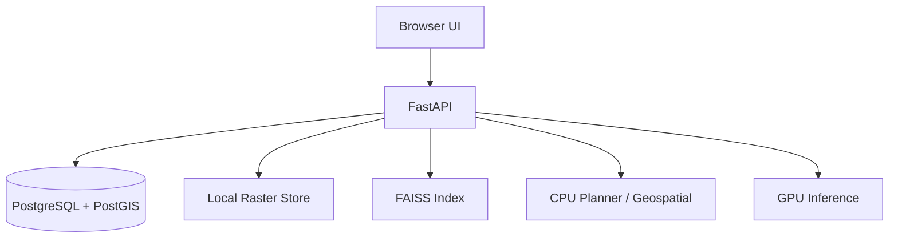

# Tessera-X — System Architecture

> **Detailed Technical Architecture**
>
> Tessera-X is an offline semantic Earth-observation intelligence system that compiles natural-language analyst intent into validated geospatial computation, performs semantic retrieval and temporal change analysis, and returns reproducible source-linked evidence.

---

# 1. Architectural Goal

The system must answer questions of the form:

```text
show me new construction near the river since 2022
```

without relying on a cloud service and without pretending that one model can solve:

- language parsing
- semantic visual retrieval
- geometric spatial relations
- temporal reasoning
- image registration
- change detection
- provenance
- analyst judgment

The architecture therefore decomposes the problem.

```text
LANGUAGE
    ↓
CONTROL PLANE
    ↓
GEOSPATIAL + SEMANTIC EXECUTION
    ↓
TEMPORAL EVIDENCE
    ↓
ANALYST VERDICT
    ↓
REPRODUCIBLE KNOWLEDGE
```

---

# 2. Architectural Invariants

The following rules are treated as invariants.

## A1 — Semantic encoder stability

Normal ingestion does not update the semantic encoder.

## A2 — No hidden spatial reasoning

Precise relations such as distance and containment are executed by geospatial operators.

## A3 — Planner is not evidence

The planner may interpret intent but cannot create observational facts.

## A4 — Independent constraint validation

The system independently checks high-value constraints from raw user language.

## A5 — Expensive inference is terminal

Change inference only runs after candidate reduction and quality gating.

## A6 — Source observations remain authoritative

Synthetic visualization cannot replace raw optical/SAR evidence.

## A7 — Every output cites a release

A result without model/index/data versions is not reproducible.

## A8 — Historical results remain reproducible across model upgrades

New embedding models create new namespaces.

## A9 — Analyst verdicts do not contaminate the locked evaluation slice

Feedback and evaluation are separate data channels.

## A10 — A model upgrade cannot be a single point of failure

Advanced models sit behind gates and preserve a stable baseline.

---

# 3. High-Level Architecture



---

# 4. Layer Model

Tessera-X is divided into eight logical layers.

| Layer | Responsibility |
|---|---|
| Layer 0 | Query understanding |
| Layer 1 | Validation and orchestration |
| Layer 2 | Geospatial data and metadata |
| Layer 3 | Semantic retrieval |
| Layer 4 | Temporal quality and registration |
| Layer 5 | Change intelligence |
| Layer 6 | Evidence and analyst workflow |
| Layer 7 | Knowledge, provenance, and versioning |

These are logical boundaries. The first release does not require one microservice per box.

---

# 5. Layer 0 — Query Understanding

## 5.1 Purpose

Convert free-form language into a typed plan.

The planner must answer:

```text
What is the target?
Where?
When?
What relation?
Which sensors?
What quality constraints?
What operation is requested?
What is explicit?
What is defaulted?
What remains unresolved?
```

## 5.2 `GeoQueryPlan`

The plan is the stable interface between language and compute.

Conceptual schema:

```python
class GeoQueryPlan:
    plan_id: str
    raw_query: str
    intent: str

    targets: list[TargetConcept]
    text_prompts: list[str]
    negative_prompts: list[str]

    spatial: SpatialSpec
    temporal: TemporalSpec
    filters: FilterSpec

    budget: BudgetSpec

    explicit_constraints: list[Constraint]
    defaults_applied: list[Default]
    ignored_terms: list[str]
    unresolved_slots: list[str]

    planner_mode: str
    prompt_version: str | None
    lexicon_version: str
    relation_policy_version: str
    release_id: str
```

## 5.3 Planner tiers

Execution order:

```text
cache
  ↓ miss
rules
  ↓ unsupported/free-form
local constrained LLM
  ↓ failure
rules fallback / clarification
```

A fixed demo path should succeed through the deterministic rules tier.

## 5.4 Why an LLM is not the direct search engine

The local LLM must not:

- inspect source images
- decide change truth
- calculate geospatial distance
- directly modify the database
- invent a missing feature layer
- silently broaden the AOI
- silently alter dates

Its output is only a proposed structured computation.

---

# 6. Independent Constraint Checker

## 6.1 Problem

A planner that produces:

```json
{
  "distance_m": 300,
  "ignored_terms": []
}
```

cannot be trusted to detect that the user actually wrote:

```text
within 500 m
```

if the same planner made the mistake.

## 6.2 Independent extraction

A deterministic checker separately extracts:

### Temporal

- ISO-like dates
- years
- since/before/after/between
- relative ranges resolved using session context

### Numeric

- meters
- kilometers
- counts
- top-K
- percentage thresholds

### Geospatial

- known AOIs
- location identifiers
- near/beside/inside/outside/along

### Domain

- sensor names
- supported target concepts
- feature classes
- negation

## 6.3 Comparison

For every extracted constraint:

```text
raw constraint
    ↓
must map to:
    plan field
or
    ignored/unresolved field
```

Hard mismatch:

```text
user: 500 m
plan: 300 m
```

Soft mismatch:

```text
user: near
plan: default 300 m
```

Soft mismatch is permitted only when:

```text
default_applied = true
policy_id is recorded
```

## 6.4 Checker output

```yaml
constraint_check:
  passed: false
  errors:
    - type: explicit_numeric_changed
      raw: 500
      planned: 300
      unit: m
  warnings: []
```

---

# 7. Planner Confidence

## 7.1 Policy

Planner confidence is computed, not self-reported.

## 7.2 Suggested components

```text
S = slot coverage
C = explicit constraint preservation
L = lexicon coverage
K = capability coverage
D = default burden
F = fallback burden
```

An initial deterministic score can be:

```text
PlanConfidence =
    S × C × L × K × (1 - D) × (1 - F)
```

All terms are bounded to `[0,1]`.

This formula is only a starting policy.

It should later be calibrated against the planner benchmark.

## 7.3 Clarification triggers

Clarification is appropriate when:

- required AOI cannot be resolved
- required temporal scope cannot be resolved
- target concept is unsupported
- explicit constraints conflict
- capability is unavailable
- execution would be materially degraded from the requested scope

Do not ask merely because a model reports low subjective confidence.

---

# 8. Lexicon

## 8.1 Purpose

The semantic encoder cannot reliably represent arbitrary analyst terminology.

The lexicon maps analyst concepts to supported remote-sensing phrasing.

Example:

```yaml
id: LEX_BUILDING_DENSE
canonical: building
aliases:
  - buildings
  - new construction
  - residential structures
prompts:
  - dense building footprints
  - recently constructed rooftops
supported_for:
  - semantic_retrieval
```

## 8.2 Unknown terms

If a central target has no supported lexicon mapping:

```text
do not generate confident prompts anyway
```

Return:

```text
unresolved concept
```

or request clarification.

---

# 9. Session Context

The query planner may use current UI context.

Example:

```json
{
  "viewport_bbox": [80.11, 12.65, 80.22, 12.74],
  "active_aoi": "AOI_PUDUPPAIR",
  "timeline_selection": ["2022-01-01", "2026-08-31"],
  "sensor_toggles": ["S2"],
  "active_workspace": "change",
  "last_plan_id": "PLAN_..."
}
```

Context-derived values are still marked as:

```text
source = session_context
```

They are different from explicit analyst text.

---

# 10. Layer 1 — Validation and Orchestration

## 10.1 Validator responsibilities

Before compute:

### Schema check

Is the plan structurally valid?

### Constraint check

Did any important raw-query constraint disappear or change?

### Capability check

Can requested operators run?

### Coverage check

Does the archive cover the AOI and time range?

### Feature-layer check

Does the required river/road/etc. layer cover the AOI?

### Temporal check

Are at least two suitable observations potentially available?

### Budget check

Will the plan exceed configured candidate limits?

---

# 11. DAG Compiler

## 11.1 Typed operators

Recommended operators:

| Operator | Input | Output |
|---|---|---|
| `resolve_aoi` | AOI spec | geometry |
| `filter_stac` | geometry + filters | scene/patch IDs |
| `spatial_relation_filter` | patches + feature layer | patch IDs + relation evidence |
| `encode_text` | prompts | query vector |
| `semantic_topk` | vector + candidate domain | ranked patches |
| `image_topk` | patch | ranked patches |
| `pair_select` | candidate + timeline | T1/T2 pairs |
| `register_pair` | T1/T2 | registered pair + QA |
| `quality_gate` | pair + masks | accepted pair |
| `change_infer` | pair | change result |
| `temporal_localize` | candidate timeline | earliest support |
| `fuse_rank` | ranked evidence | candidate ranking |
| `explain` | run graph | human trace |

## 11.2 Operator metadata

Each operator declares:

```yaml
name:
version:
cpu_required:
gpu_required:
cacheable:
input_types:
output_type:
cost_unit:
```

---

# 12. Cost and Budget Model

## 12.1 Purpose

Prevent an analyst sentence from triggering expensive archive-wide computation.

## 12.2 Candidate cascade

Preferred cascade:

```text
archive
 ↓ metadata/AOI/date
candidate domain
 ↓ semantic search
top-K
 ↓ spatial relation
spatially valid
 ↓ temporal pair availability
pair candidates
 ↓ quality + registration
valid pairs
 ↓ change inference
evidence
```

## 12.3 Budget fields

```yaml
max_candidates:
max_change_pairs:
max_registration_pairs:
preview_limit:
```

Time estimates may be recorded internally, but correctness does not depend on a guessed wall-clock duration.

## 12.4 Degradation

If over budget:

1. reduce only defaults, never explicit user constraints
2. lower semantic K
3. lower change-pair cap while preserving ranking
4. switch to preview
5. request narrower scope

Every degradation is logged.

---

# 13. Explain Trace

A plan-run trace should include:

```yaml
plan_id:
release_id:
operators:
  - name: filter_stac
    input_count: 1040000
    output_count: 23412
  - name: semantic_topk
    input_count: 23412
    output_count: 2000
  - name: spatial_relation_filter
    input_count: 2000
    output_count: 186
  - name: quality_gate
    input_count: 61
    output_count: 38
degraded: false
defaults:
ignored_terms:
cache_hits:
```

This trace is persisted as provenance.

---

# 14. Layer 2 — Data and Metadata

## 14.1 Raster standard

Canonical raster representation:

```text
Cloud Optimized GeoTIFF
```

when suitable for the source product.

## 14.2 STAC

STAC-compatible metadata stores:

- scene identity
- acquisition time
- footprint
- platform
- sensor
- source assets
- derived assets

## 14.3 PostgreSQL/PostGIS

Responsible for:

- scene footprints
- patch footprints
- AOIs
- feature layers
- spatial relations
- quality metadata
- graph nodes/edges
- query plans
- release metadata

---

# 15. Data Model — Core Tables

## 15.1 Scenes

```sql
scenes(
    scene_id             text primary key,
    platform             text,
    sensor               text,
    acquisition_time     timestamptz,
    footprint            geometry(MultiPolygon, 4326),
    crs                   text,
    gsd_m                 double precision,
    cloud_cover           double precision,
    asset_uri             text,
    checksum_sha256       text,
    release_id            text
);
```

## 15.2 Patches

```sql
patches(
    patch_id              text primary key,
    scene_id              text references scenes(scene_id),
    pixel_x               integer,
    pixel_y               integer,
    width_px              integer,
    height_px             integer,
    geom                   geometry(Polygon, 4326),
    quality_score          double precision,
    vector_id              bigint,
    embedding_namespace    text
);
```

## 15.3 Quality

```sql
observation_quality(
    quality_id             bigserial primary key,
    scene_id               text references scenes(scene_id),
    patch_id               text,
    cloud_fraction         double precision,
    nodata_fraction        double precision,
    usable_fraction        double precision,
    quality_score          double precision,
    policy_version         text
);
```

## 15.4 Registration

```sql
registration_records(
    registration_id        text primary key,
    reference_scene_id     text,
    target_scene_id        text,
    geom                    geometry(Polygon, 4326),
    rmse_px                 double precision,
    shift_x_px              double precision,
    shift_y_px              double precision,
    valid_control_points    integer,
    usable_overlap          double precision,
    quality_score           double precision,
    status                  text,
    algorithm_version       text
);
```

---

# 16. Feature Layers

## 16.1 Sources

Potential local layers:

- OSM waterways
- OSM roads
- OSM railways
- OSM built-up polygons
- OSM quarry features
- organizer-provided vectors
- date-specific NDWI water masks

## 16.2 Versioning

```sql
feature_layers(
    layer_id        text primary key,
    feature_class   text,
    source          text,
    licence         text,
    coverage        geometry(MultiPolygon, 4326),
    version         text,
    checksum        text,
    ingested_at     timestamptz
);
```

No spatial claim should reference a mutable “latest” layer without a version.

---

# 17. Spatial Relation Engine

## 17.1 Core supported relations

### Distance

```text
near
close to
beside
along
away from
```

### Containment

```text
inside
within
outside
```

Unsupported directional/topological terms are declared rather than approximated.

Examples:

```text
upstream of
north of
between complex polygons
```

may be deferred until formally implemented.

## 17.2 Versioned policy

```sql
relation_policy(
    policy_id           text primary key,
    relation            text,
    feature_class       text,
    default_distance_m  double precision,
    min_distance_m      double precision,
    max_distance_m      double precision,
    version             text,
    active              boolean
);
```

## 17.3 Geometry semantics

MVP relation evidence is patch-level.

Safe statement:

```text
candidate patch is within 300 m of river geometry
```

Unsafe statement without an object mask:

```text
the building is exactly 140 m from the river
```

If object-level segmentation becomes available, the evidence type can be upgraded explicitly.

---

# 18. Layer 3 — Semantic Retrieval

## 18.1 Encoder

Primary:

```text
LRSCLIP
```

The architecture keeps encoder weights immutable inside an embedding namespace.

## 18.2 Patch preprocessing

Persist preprocessing version:

```yaml
input_bands:
normalization:
resize:
crop:
channel_mapping:
```

## 18.3 Embedding record

```sql
embedding_refs(
    vector_id            bigint primary key,
    patch_id             text references patches(patch_id),
    namespace            text,
    dim                  integer,
    model_name           text,
    model_version        text,
    preprocessing_version text,
    shard_id             text
);
```

## 18.4 Prompt ensemble

Optional query enhancement:

```text
v =
normalize(
    average(
        normalize(E(prompt_i))
    )
)
```

Enable only after evaluation.

The prompt list is stored in provenance.

---

# 19. FAISS Architecture

## 19.1 Index

Initial:

```text
IndexHNSW
```

Optional:

```text
SQ8
```

when benchmarked.

## 19.2 Incremental ingestion

Vectors append to the current namespace.

No semantic-model update is required.

## 19.3 Shards

Advanced layout:

```text
index/
  ns_lrsclip_v1_768/
    SH_0001.faiss
    SH_0002.faiss
    SH_0003_open.faiss
    tombstones.bitmap
    manifest.json
```

Sealed shards are immutable.

---

# 20. Hybrid Search

The final candidate set may combine:

```text
metadata eligibility
semantic relevance
spatial relation validity
quality
analyst reranking
```

A single scalar score must not hide hard constraints.

Recommended policy:

```text
hard filters:
    AOI
    date
    supported sensor
    required spatial relation
    minimum quality

ranking signals:
    semantic similarity
    quality score
    optional reranker score
```

Hard constraints are not converted into soft similarity bonuses.

---

# 21. Layer 4 — Temporal Pairing

## 21.1 Pair-selection requirements

For candidate location `C`, choose observations satisfying:

```text
overlap(C, scene) sufficient
quality(scene) acceptable
registration possible
temporal ordering valid
sensor policy valid
```

## 21.2 Pair policy examples

```text
baseline_vs_latest
nearest_valid_pair
earliest_supported
user_selected
```

---

# 22. Registration

AROSICS may be used for local geometric co-registration.

Output is not just a corrected image.

It is also a quality record.

```yaml
registration:
  status: accepted
  rmse_px: 0.41
  valid_control_points: 37
  overlap: 0.93
  algorithm: arosics
  version: ...
```

Registration quality influences downstream confidence.

---

# 23. Quality Gate

## 23.1 Inputs

- cloud
- cloud shadow
- nodata
- saturation
- usable overlap
- registration quality
- optional sensor compatibility

## 23.2 Outputs

```text
PASS
PASS_WITH_PENALTY
REJECT
```

## 23.3 Principle

A rejected pair costs:

```text
zero change-inference calls
```

after the rejection point.

---

# 24. Layer 5 — Binary Change Model

## 24.1 ChangeFormer baseline

Role:

```text
binary change localization
```

Pipeline:



## 24.2 Output schema

```yaml
change_result_id:
scene_t1:
scene_t2:
mask_uri:
model_name:
model_version:
model_confidence:
effective_confidence:
registration_id:
quality_policy_version:
release_id:
```

---

# 25. UniChange Architecture

## 25.1 Correct conceptual model

UniChange is not a conventional Siamese change classifier.

It is treated as a unified MLLM-based change-detection architecture.

Conceptually:



## 25.2 Modes

### BCD

Instruction asks for changed regions.

Output:

```text
binary change mask
```

### SCD

Instruction asks for semantic states and change.

Output can represent:

```text
vegetation → building
bare ground → building
water → bare ground
```

## 25.3 Gate

UniChange is optional until:

- implementation reproduces
- checkpoint is available
- hardware is sufficient
- benchmark is reproduced
- semantic value is measured

---

# 26. Quality-Aware Confidence

Initial formulation:

```text
EffectiveConfidence =
ModelConfidence
× RegistrationQuality
× ObservationQuality
```

This is intentionally conservative.

Later, calibrate a mapping:

```text
f(
  model_score,
  registration_rmse,
  cloud_fraction,
  usable_fraction,
  sensor_pair,
  season
)
→ calibrated_probability
```

using development labels only.

---

# 27. False-Alarm Taxonomy

Every false positive should be classifiable.

```text
CLOUD
CLOUD_SHADOW
SEASONAL_VEGETATION
HARVEST_STATE
WATER_SEASONALITY
REGISTRATION_EDGE
SENSOR_SHIFT
ILLUMINATION
UNKNOWN
```

This taxonomy allows the project to improve specific failure modes rather than only optimize aggregate F1.

---

# 28. Temporal Localization

## 28.1 Problem with naive binary search

A satellite sequence is not:

```text
no
no
no
yes
yes
yes
```

It may be:

```text
no
cloud
no
bad registration
yes
cloud
yes
```

## 28.2 Algorithm

1. retrieve overlapping observations
2. calculate/attach quality
3. remove unusable observations
4. choose trusted baseline
5. evaluate a coarse set of valid observations
6. narrow to previous valid observations
7. confirm persistence when appropriate
8. report earliest support

## 28.3 Output language

Correct:

> earliest supported observation: 2026-03-29

Incorrect:

> construction began on 2026-03-29

The latter exceeds what the imagery proves.

---

# 29. Layer 6 — Evidence Fusion

## 29.1 Evidence object

An evidence object combines:

```text
semantic result
spatial relation proof
temporal observations
registration
quality
change mask
timeline
release information
```

## 29.2 Rank fusion

Use rank fusion only for soft signals.

Never use it to override:

- unsupported time range
- failed required relation
- failed quality gate
- missing source scene

---

# 30. Analyst Workspace

Required views:

### Search

- query
- parsed plan
- map
- ranked candidates

### Plan explanation

- explicit constraints
- defaults
- ignored terms
- operator cascade
- candidate counts

### Evidence

- T1/T2 imagery
- change mask
- spatial relation geometry
- quality
- registration

### Timeline

- all candidate observations
- usability
- earliest support

### Verdict

- confirm
- reject
- uncertain
- note

---

# 31. Layer 7 — Knowledge Substrate

## 31.1 Why PostgreSQL/PostGIS

The system already needs:

- relational data
- geometry
- spatial indexing
- transactions
- JSON attributes

Adding a dedicated graph database is not required for the core knowledge model.

## 31.2 Nodes

```text
Site
AOI
Scene
Patch
ChangeEvent
Query
Candidate
Verdict
Concept
Feature
Model
IndexVersion
Release
Report
```

## 31.3 Edges

```text
Patch       --observed_in----> Scene
Patch       --depicts--------> Concept
Candidate   --for_query------> Query
Candidate   --refers_to------> Patch/Site
Verdict     --judges---------> Candidate
ChangeEvent --at_site--------> Site
ChangeEvent --baseline-------> Scene
ChangeEvent --comparison-----> Scene
ChangeEvent --classified_as--> Concept
ChangeEvent --derived_from---> Release
Site        --located_near---> Feature
Report      --cites----------> ChangeEvent
```

This models change events explicitly.

---

# 32. Knowledge Tables

```sql
kg_nodes(
    node_id       text primary key,
    node_type     text not null,
    label         text,
    geom          geometry(Geometry, 4326),
    valid_from    timestamptz,
    valid_to      timestamptz,
    attrs         jsonb,
    release_id    text,
    created_at    timestamptz default now()
);
```

```sql
kg_edges(
    edge_id       bigserial primary key,
    src_id        text references kg_nodes(node_id),
    dst_id        text references kg_nodes(node_id),
    edge_type     text not null,
    weight        double precision,
    attrs         jsonb,
    release_id    text,
    created_at    timestamptz default now()
);
```

Indexes:

```sql
create index on kg_edges (src_id, edge_type);
create index on kg_edges (dst_id, edge_type);
create index on kg_nodes using gist (geom);
```

---

# 33. Sparse Similarity Projection

## 33.1 Rule

Do not construct dense similarity edges for every patch.

FAISS is the similarity source of truth.

## 33.2 Materialization policy

Materialize top-N neighbors only for:

- confirmed sites
- reference exemplars
- active review candidates

Example edge:

```yaml
edge_type: similar_to
src: SITE_0042
dst: SITE_0051
rank: 3
distance: 0.18
encoder_version: LRSCLIP-v1
embedding_namespace: ns_lrsclip_v1_768
release_id: REL_...
```

## 33.3 Invalidation

When the encoder namespace changes:

```text
old similarity edges remain historical
new operational projection is recomputed
```

---

# 34. Analyst Notes / Vault

An Obsidian-readable Markdown vault is optional.

If used:

- database is machine truth
- generated note content is not manually edited
- analyst notes occupy an explicit editable region
- human-authored links are hypotheses until reviewed
- synchronization is explicit, not hidden background mutation

This feature is not required for the core evidence path.

---

# 35. Query Plan Tables

```sql
query_plans(
    plan_id                  text primary key,
    raw_query                text not null,
    session_ctx              jsonb,
    plan_json                jsonb not null,
    planner_mode             text,
    prompt_version           text,
    lexicon_version          text,
    relation_policy_version  text,
    plan_confidence          double precision,
    edited_by_user           boolean default false,
    plan_diff                jsonb,
    release_id               text,
    created_at               timestamptz default now()
);
```

```sql
constraint_checks(
    check_id            bigserial primary key,
    plan_id             text references query_plans(plan_id),
    passed              boolean,
    extracted_json      jsonb,
    errors              jsonb,
    warnings            jsonb,
    checker_version     text,
    created_at          timestamptz default now()
);
```

```sql
plan_runs(
    run_id            bigserial primary key,
    plan_id           text references query_plans(plan_id),
    dag_json          jsonb,
    candidate_trace   jsonb,
    degraded          boolean default false,
    degrade_reason    text,
    budget_json       jsonb,
    cache_hits        integer,
    status            text,
    created_at        timestamptz default now()
);
```

---

# 36. Relation Evidence Table

```sql
relation_evidence(
    relation_result_id  text primary key,
    plan_id             text,
    patch_id            text,
    feature_id          text,
    feature_layer_id    text,
    predicate           text,
    distance_m          double precision,
    policy_id           text,
    explicit_distance   boolean,
    patch_geometry_mode text,
    release_id          text
);
```

This prevents a distance claim from being detached from its geometry source.

---

# 37. Change Results

```sql
change_results(
    change_id               text primary key,
    patch_id                text,
    scene_t1                text,
    scene_t2                text,
    geom                    geometry(Polygon, 4326),
    change_type             text,
    model_confidence        double precision,
    effective_confidence    double precision,
    mask_uri                text,
    model_name              text,
    model_version           text,
    registration_id         text,
    plan_id                 text,
    release_id              text,
    created_at              timestamptz
);
```

---

# 38. Temporal Localization Results

```sql
temporal_results(
    temporal_result_id          text primary key,
    change_id                   text,
    baseline_scene_id           text,
    last_supported_no_change    timestamptz,
    earliest_supported_change   timestamptz,
    confirming_scene_id         text,
    skipped_scenes              jsonb,
    confidence                  double precision,
    algorithm_version           text,
    release_id                  text
);
```

---

# 39. Verdicts

```sql
analyst_verdicts(
    verdict_id       text primary key,
    candidate_id     text,
    analyst_id       text,
    verdict          text,
    note             text,
    release_id       text,
    created_at       timestamptz
);
```

Allowed:

```text
confirm
reject
uncertain
```

---

# 40. Ground Truth Architecture

Evaluation data is not a single dataset.

It is a set of claim-specific label packs.

## 40.1 Retrieval labels

```text
query
candidate
relevance 0/1/2
annotator
adjudication
```

## 40.2 Binary change labels

```text
T1
T2
binary mask
change present
quality flags
```

## 40.3 Semantic change labels

```text
T1 class
T2 class
change mask
transition
```

## 40.4 Temporal labels

```text
last supported no change
earliest supported change
next confirmation
unusable scenes
```

## 40.5 Planner labels

```text
raw query
expected intent
expected constraints
expected defaults allowed
expected unsupported fields
```

---

# 41. Evaluation Metrics

## Retrieval

- nDCG@5
- nDCG@10
- Precision@5
- Precision@10
- MRR

## Binary change

- Precision
- Recall
- F1
- IoU

## Semantic change

Use benchmark-appropriate SCD metrics such as:

- mIoU
- F_scd
- F_bcd
- SeK

when the selected benchmark and implementation support them.

## Temporal

- exact acquisition match
- valid-acquisition error
- median temporal error
- usable-scene skip accuracy

## Planner

- intent accuracy
- slot exact match
- explicit-constraint preservation
- numeric preservation
- ignored-term recall
- unsupported-capability detection
- execution success rate

## System

- P50/P95/P99 latency
- memory
- index size
- embedding throughput
- candidate reduction
- cache hit rate

---

# 42. Evidence Labels

Every reported number is tagged:

```text
MEASURED
LITERATURE
TARGET
```

These categories must not be mixed.

Example:

```text
P95 semantic search latency
TARGET: < 1 s
MEASURED: 0.42 s
```

A target is never presented as benchmark evidence.

---

# 43. Provenance Graph

A report should be traceable through:

```text
Report
  ↓ cites
ChangeEvent
  ↓ derived_from
Release
  ↓ contains
Model + Index + Data versions

ChangeEvent
  ↓ baseline/comparison
Scenes

Query
  ↓ Candidate
  ↓ Verdict
Analyst decision
```

---

# 44. Release Manifest

Example:

```json
{
  "release_id": "REL_2026_09_05",
  "git_commit": "9c1f4ab...",

  "models": [
    {
      "role": "semantic_encoder",
      "name": "LRSCLIP",
      "version": "v1",
      "weights_sha256": "sha256:..."
    },
    {
      "role": "change_detector",
      "name": "ChangeFormerV6",
      "version": "v1",
      "weights_sha256": "sha256:..."
    }
  ],

  "embedding_namespace": "ns_lrsclip_v1_768",

  "index_shards": [
    {
      "shard_id": "SH_0001",
      "sha256": "sha256:...",
      "sealed": true
    }
  ],

  "stac_snapshot_sha256": "sha256:...",
  "feature_db_version": "osm_2026_06",
  "lexicon_version": "lex_v2",
  "prompt_version": "v3",
  "relation_policy_version": "rel_v1",
  "quality_policy_version": "qa_v1",
  "label_pack_version": "lp_v1",
  "eval_report_sha256": "sha256:..."
}
```

---

# 45. Artifact Versioning

## Code

Git.

## Small decision artifacts

Git:

- schemas
- prompts
- grammars
- labels
- evaluation definitions
- policy YAML
- migrations

## Large artifacts

CAS or DVC local remote:

- COGs
- patch packs
- weights
- masks
- FAISS shards

## Database

- migrations
- logical snapshots as needed
- release references

---

# 46. Cache Key Design

Every cache key includes enough version information to prevent cross-release contamination.

```text
hash(
    operator_name,
    operator_version,
    parameters,
    sorted_input_ids,
    model_version,
    embedding_namespace,
    release_id
)
```

A promoted model cannot read a cache entry generated under the previous namespace.

---

# 47. Embedding Migration

## 47.1 Problem

Frozen embeddings make ingestion stable.

They also mean a new foundation model requires a new embedding space.

## 47.2 Procedure

```text
new encoder
  ↓
new namespace
  ↓
priority re-embed
  ↓
dual-query mode
  ↓
locked benchmark
  ↓
promotion
```

## 47.3 Priority

1. analyst-verdict patches
2. confirmed sites
3. active AOIs
4. remaining archive

## 47.4 Promotion gate

Primary:

- locked retrieval benchmark does not regress
- operational target concepts improve or have justified trade-offs
- runtime/storage remain acceptable

Diagnostic:

- old/new top-K overlap
- disagreement examples
- rank correlation

Old-model agreement is not a requirement because a better model may intentionally produce different rankings.

## 47.5 Historical reproducibility

Old namespace remains read-only.

Old reports continue to cite the old release.

---

# 48. Security and Sovereignty

The operational environment is offline.

Controls may include:

- no outbound network
- local authentication
- role-based authorization
- encrypted storage
- model hash verification
- artifact hash verification
- immutable/restricted release manifests
- audit log
- controlled update packages

---

# 49. API Architecture

## Plan

```http
POST /plan
```

Input:

```json
{
  "query": "new construction near the river since 2022",
  "session": {}
}
```

Output:

```json
{
  "plan": {},
  "constraint_check": {},
  "clarifications": []
}
```

## Execute

```http
POST /plan/{plan_id}/execute
```

## Explain

```http
GET /plan/{plan_id}/explain
```

## Simple search

```http
POST /search
```

Internally:

```text
plan + validate + execute
```

## Change

```http
POST /change/analyze
```

## Earliest support

```http
POST /change/earliest-supported
```

## Similar

```http
POST /similar
```

## Verdict

```http
POST /verdict
```

## Release

```http
GET /release/{release_id}
POST /release
```

---

# 50. Example End-to-End Plan

Input:

```text
show me new construction near the river since 2022
```

### Step 1 — Rules/LLM planner

Extract:

```yaml
intent: change_search
target: building
relation: near
feature: waterway_river
start: 2022-01-01
```

### Step 2 — Independent checker

Confirms:

```text
construction accounted for
near accounted for
river accounted for
2022 accounted for
```

### Step 3 — Context

AOI filled from active workspace.

Marked:

```text
source = session_context
```

### Step 4 — Relation default

No distance specified.

Policy:

```text
REL_NEAR_RIVER_V1 = 300 m
```

Marked:

```text
default_applied = true
```

### Step 5 — Metadata reduction

Filter:

```text
AOI
time
sensor
quality availability
```

### Step 6 — Semantic retrieval

Encode building/construction prompt ensemble.

Retrieve top-K.

### Step 7 — Spatial relation

Apply river-distance predicate to patch polygons.

### Step 8 — Temporal availability

Keep candidates with usable temporal observations.

### Step 9 — Registration/quality

Reject unsuitable pairs.

### Step 10 — Change inference

Run ChangeFormerV6.

### Step 11 — Temporal localization

Find earliest supported observation.

### Step 12 — Evidence

Render:

- query plan
- reduction trace
- patch
- relation geometry
- T1/T2
- mask
- timeline
- provenance

### Step 13 — Analyst verdict

Persist decision and evidence path.

---

# 51. Failure Mode — Planner Invents Constraint

Risk:

```text
user did not specify cloud threshold
planner silently applies strict threshold
```

Mitigation:

- every default marked
- plan displayed
- independent checker
- plan diff on analyst edit

---

# 52. Failure Mode — Planner Drops Constraint

Risk:

```text
"near river" disappears
```

Mitigation:

- independent constraint extraction
- relation terms must map to plan or unresolved/ignored
- failed check prevents execution

---

# 53. Failure Mode — Incorrect Spatial Claim

Risk:

```text
patch centroid 140 m from river
```

is presented as:

```text
building 140 m from river
```

Mitigation:

- patch polygon used for MVP relation
- evidence type explicitly says patch-level
- object-level distance only after object segmentation/geometry exists

---

# 54. Failure Mode — Universal Distance Defaults

Risk:

```text
near river = near road = near parcel
```

Mitigation:

- relation + feature-class policy
- versioned defaults
- explicit analyst value overrides policy

---

# 55. Failure Mode — Cloud/Season False Change

Mitigation:

- quality masks
- hard-negative evaluation
- quality gate
- effective confidence
- optional SAR extension

---

# 56. Failure Mode — Registration Edge Artifacts

Mitigation:

- AROSICS
- RMSE/quality gate
- reject unacceptable pair
- dedicated hard negatives

---

# 57. Failure Mode — Encoder Drift

Mitigation:

- frozen encoder during ingestion
- new namespace for upgrade
- locked benchmark promotion

---

# 58. Failure Mode — Stale Similarity Graph

Mitigation:

- sparse similarity projection
- encoder version on each edge
- recompute on namespace promotion
- FAISS remains authoritative

---

# 59. Failure Mode — Feedback Loop Bias

Risk:

```text
reranker surfaces one concept
analysts mostly see that concept
verdicts reinforce that concept
```

Mitigation:

- fixed evaluation holdout
- concept-distribution monitoring
- independent label pack
- reranker never trained on locked test labels

---

# 60. Failure Mode — Cache Across Releases

Mitigation:

```text
release_id
+
model_version
+
namespace
```

inside cache key.

---

# 61. Failure Mode — Missing Feature Coverage

If river geometry does not cover the AOI:

Correct behavior:

```text
spatial relation unavailable for this AOI
```

Possible action:

```text
degrade to semantic-only preview
```

only if explicitly shown to analyst.

Never pretend the relation was checked.

---

# 62. Failure Mode — Unsupported Query

Example:

```text
find development upstream of this river
```

if upstream topology is unavailable.

Return:

```text
unsupported spatial relation: upstream
```

not a fabricated similarity result.

---

# 63. Deployment Topology

A compact offline deployment can run on one workstation/server.



No Kubernetes requirement.

---

# 64. Logical Service Boundaries

Code modules may be:

```text
planner
validator
orchestrator
metadata
geospatial
embedding
retrieval
registration
quality
change
temporal
evidence
knowledge
provenance
evaluation
```

They may share a process initially.

Service separation should follow measured operational need, not architectural aesthetics.

---

# 65. Observability

Record per run:

```yaml
plan_id:
run_id:
release_id:
operator:
input_count:
output_count:
cache_hit:
cpu_time:
gpu_time:
error:
warning:
```

Aggregate:

- candidate-reduction ratios
- failure reasons
- registration rejection rate
- planner mismatch rate
- semantic retrieval latency
- change inference utilization

---

# 66. Logging Policy

Avoid logging:

- raw sensitive imagery bytes
- unnecessary personal data

Do log:

- immutable IDs
- hashes
- versions
- operator decisions
- quality reasons
- analyst verdict references

---

# 67. Reproducibility Command

Target workflow:

```bash
python -m tessera_x.repro run \
  --release REL_2026_09_05 \
  --result CHG_00942
```

Procedure:

1. resolve release manifest
2. verify code/model/data hashes
3. load named embedding namespace
4. load required index shards read-only
5. load plan
6. replay deterministic operators
7. rerun inference if required
8. compare outputs/hashes
9. report differences

---

# 68. Architectural Scope Boundaries

## Core

- offline ingestion
- STAC/PostGIS
- frozen semantic retrieval
- deterministic relation grounding
- query plan
- independent constraint checker
- quality/registration
- binary change detection
- earliest-supported observation
- provenance
- ground-truth evaluation

## Advanced

- local LLM planner
- UniChange semantic detection
- sparse knowledge-driven similarity
- feedback reranker
- embedding migration automation
- SAR fusion

## Explicitly excluded from the evidence path

- hallucinated optical replacement
- hidden planner reasoning
- unversioned external feature services
- silent model upgrades
- arbitrary archive-wide change inference

---

# 69. Final Architecture Summary

```text
ANALYST
   │
   ▼
QUERY + CONTEXT
   │
   ▼
GeoQueryPlan
   │
   ├── Independent Constraint Checker
   ├── Schema Validator
   ├── Capability Validator
   └── Budget Gate
   │
   ▼
DAG / ROUTER
   │
   ├───────────────┬────────────────┐
   ▼               ▼                ▼
STAC/PostGIS    LRSCLIP/FAISS    Feature Layers
   │               │                │
   └───────────────┴────────────────┘
                   │
                   ▼
          CANDIDATE FUSION
                   │
                   ▼
           TEMPORAL PAIRING
                   │
                   ▼
      QUALITY + REGISTRATION GATE
                   │
                   ▼
        CHANGEFORMER BASELINE
          │               │
          │          optional gated
          │            UNICHANGE
          │               │
          └───────┬───────┘
                  ▼
       TEMPORAL LOCALIZATION
                  │
                  ▼
       EVIDENCE + PROVENANCE
                  │
                  ▼
          ANALYST VERDICT
                  │
                  ▼
      KNOWLEDGE + RELEASE LAYER
```

---

# 70. Architectural Decision Summary

Tessera-X deliberately chooses:

```text
frozen embeddings
over continual encoder adaptation

PostGIS
over pretending CLIP handles distance

independent constraint validation
over planner self-confidence

ChangeFormer baseline
over making UniChange a blocking dependency

explicit ChangeEvent nodes
over ambiguous temporal graph edges

sparse similarity projections
over dense all-pairs graphs

locked benchmark promotion
over old/new model agreement as success

source observations
over generated pixels as evidence

release manifests
over unversioned "latest" state
```

These choices are what make the design operationally defensible.

---

# 71. Final Product Contract

Tessera-X should be able to make this statement truthfully:

> An analyst can ask a satellite question in natural language. Tessera-X converts the request into an inspectable geospatial plan, independently checks the constraints, retrieves relevant regions, verifies required spatial relations using versioned geometry, runs temporal change analysis only on quality-valid candidates, identifies the earliest supported observation, and returns source-linked evidence tied to a reproducible offline release.

That is the architecture.
